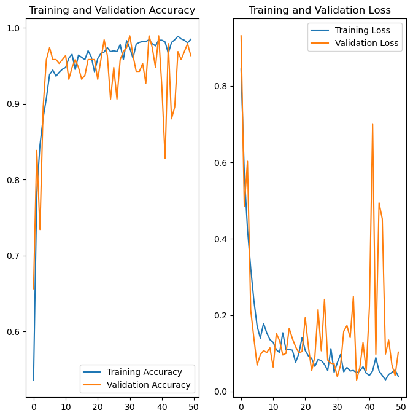
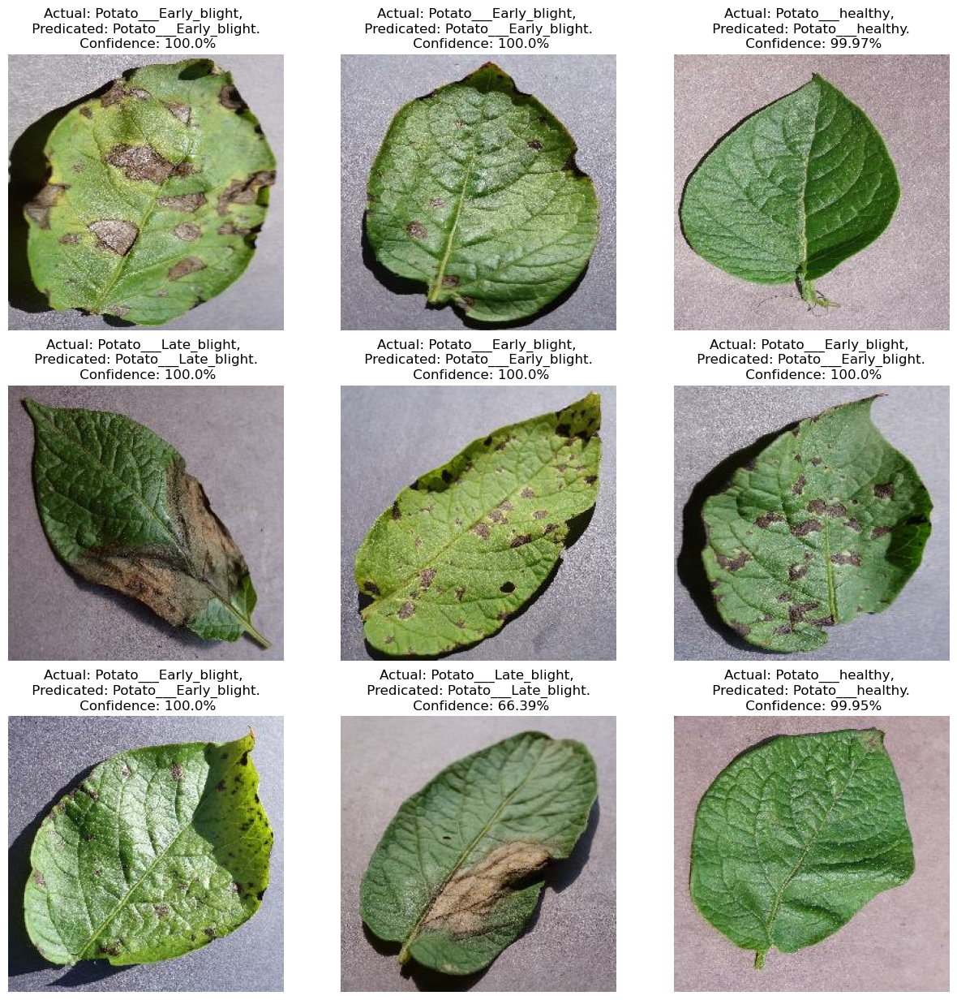

# Potato Disease Classification

This project aims to classify potato diseases based on images using convolutional neural networks (CNNs) implemented with TensorFlow Keras. The dataset was obtained from Kaggle's Plant Village repository [here](https://www.kaggle.com/datasets/arjuntejaswi/plant-village).

## Overview

The project includes data preprocessing, model building, and deployment of a web application for disease classification. The CNN model achieves accurate classification of potato diseases, enhancing agricultural management and disease control strategies.

## Model Development

The CNN model is developed using TensorFlow Keras and trained on a dataset consisting of potato disease images. The model architecture includes multiple convolutional and pooling layers for feature extraction, followed by fully connected layers for classification.


*Figure 1: Training and validation loss and accuracy curves during model training.*

### Training

The model is trained using a training dataset and validated using a validation dataset. Data augmentation techniques such as rotation and horizontal flipping are applied to improve model generalization. Training progress and performance metrics are visualized using Matplotlib.


*Figure 2: Sample images of potato leaves used for classification.*

## Web Application

The trained model is deployed as a web application using FastAPI and hosted on Google Cloud Platform (GCP). Users can upload images of potato plants to the application, which then predicts the presence of diseases and provides confidence scores.

### Deployment

The application is deployed on GCP's App Engine, allowing seamless access and scalability. It utilizes Google Cloud Storage for storing and accessing the trained model.

## Usage

To use the application:

1. **Upload Image**: Select an image of a potato plant with suspected diseases.
2. **Get Prediction**: Submit the image to the application, which predicts the disease class and provides a confidence score.

## Installation

To install the required Python packages, run:

```bash
pip install -r requirements.txt
